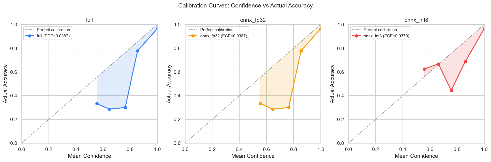
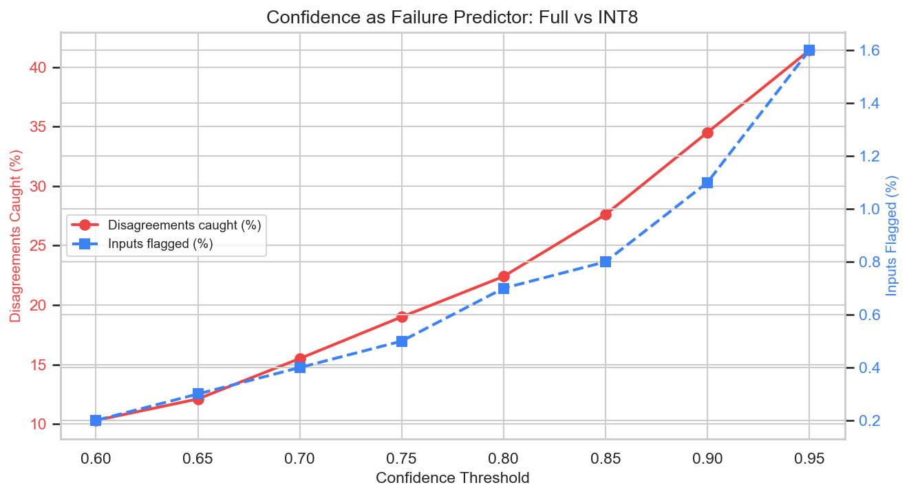
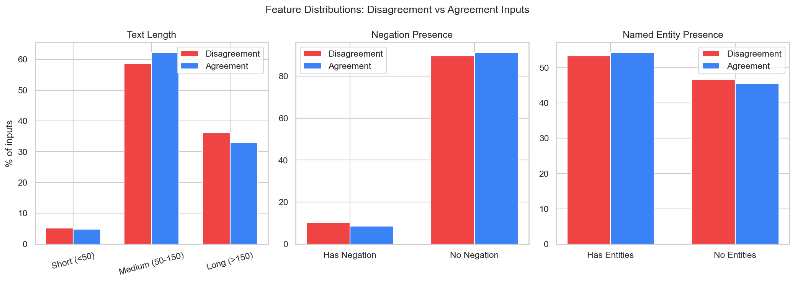
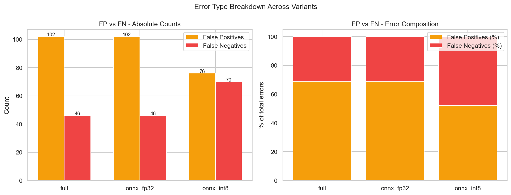
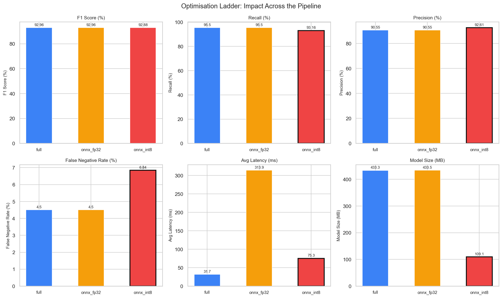

# QuantScope

A pre-deployment analysis framework for binary NLP classifiers. QuantScope measures what model optimisation actually breaks — surfacing error composition shifts, calibration drift, and confidence failure patterns that aggregate metrics like F1 hide.

---

## Motivation

Standard model evaluation answers one question: does the optimised model score similarly to the original? QuantScope asks a harder set of questions:

- When the two models disagree, what kind of inputs cause it?
- Does optimisation shift the balance between false positives and false negatives?
- Can the optimised model's own confidence score predict when it will fail?
- Is the model well-calibrated — and does quantisation change that?

These questions matter because aggregate metrics can be stable while the error structure changes in ways that are critical for deployment. A model whose F1 drops by 0.08% but whose false negative rate increases by 52% is not the same model for a high-stakes task. QuantScope makes that visible before you ship.

QuantScope is distinct from post-deployment monitoring tools like Evidently, MLflow, and W&B. It runs entirely on a held-out test set before any production traffic — it is a pre-deployment decision tool, not a runtime observability layer.

---

## What It Analyses

Given a base model and one or more optimised variants (ONNX export, INT8 quantisation, pruning, distillation), QuantScope runs six analyses:

| #   | Notebook                        | Question                                                    |
| --- | ------------------------------- | ----------------------------------------------------------- |
| 01  | Disagreement Profiling          | Where do the models give different answers?                 |
| 02  | Disagreement Categorisation     | What do disagreement inputs have in common?                 |
| 03  | Calibration Analysis            | Is confidence score trustworthy after optimisation?         |
| 04  | Confidence as Failure Predictor | Can you use confidence to route inputs to the better model? |
| 05  | Error Type Analysis             | Do FP/FN rates shift between variants?                      |
| 06  | Optimisation Ladder             | Where in the pipeline does the damage happen?               |

---

## Architecture

```
quantscope/
├── config.yaml                          ← model paths, dataset config, output dirs
├── scripts/
│   └── generate_predictions.py         ← runs all variants, saves predictions + latencies
├── quantscope/
│   ├── __init__.py                      ← public API
│   ├── disagreement.py                  ← disagreement index computation
│   ├── categorise.py                    ← text feature extraction (length, rarity, NER, negation)
│   ├── calibration.py                   ← ECE computation, bin-level accuracy vs confidence
│   └── confidence.py                    ← threshold sweep for failure detection
├── notebooks/
│   ├── 01_disagreement_profiling.ipynb
│   ├── 02_disagreement_categories.ipynb
│   ├── 03_calibration_analysis.ipynb
│   ├── 04_confidence_predictor.ipynb
│   ├── 05_error_type_analysis.ipynb
│   └── 06_optimisation_ladder.ipynb
└── results/
    ├── all_predictions.json
    ├── disagreement_summary.json
    ├── category_comparison.json
    ├── calibration_summary.json
    ├── failure_detection.json
    ├── error_summary.json
    ├── ladder_summary.json
    └── charts/
        ├── disagreement_by_category.png
        ├── calibration_curves.png
        ├── confidence_failure_curve.png
        ├── error_type_breakdown.png
        └── optimisation_ladder.png
```

### Module responsibilities

**`disagreement.py`** — Given predictions from two model variants, computes the full set of disagreement indices and splits them into hurt cases (base correct, optimised wrong) and helped cases (optimised correct, base wrong). Used in Notebooks 01 and 02.

**`categorise.py`** — Extracts four text features from each input: character length, vocabulary rarity (TF-IDF over training corpus), named entity count (spaCy), and negation presence. Designed to be domain-agnostic — no hardcoded vocabulary or entity types. Used in Notebook 02.

**`calibration.py`** — Bins predictions by confidence score and computes mean confidence vs actual accuracy per bin. Calculates Expected Calibration Error (ECE) as a scalar summary. Used in Notebook 03.

**`confidence.py`** — Sweeps a range of confidence thresholds and computes, at each threshold, what percentage of disagreements would be caught and what percentage of inputs would be flagged. Finds the optimal threshold given a minimum recall constraint. Used in Notebook 04.

---

## Notebook Walkthrough

### 01 — Disagreement Profiling

Runs all model variants against the test set and identifies where predictions differ. Produces hurt/helped split. Establishes the scale of the problem before any deeper analysis.

### 02 — Disagreement Categorisation

Extracts text features from all inputs and compares their distributions between disagreement inputs and agreement inputs. Answers whether disagreements are concentrated in a specific input type — long texts, rare vocabulary, negated sentences, entity-heavy inputs — or distributed uniformly. A uniform distribution means the optimised model is equally unreliable everywhere; a concentrated distribution means you can build targeted mitigations.

### 03 — Calibration Analysis

Plots calibration curves for all variants — mean confidence per bin vs actual accuracy. A perfectly calibrated model sits on the diagonal. Computes ECE for each variant. Reveals whether the optimised model is over- or under-confident and whether that changes post-optimisation.

### 04 — Confidence as Failure Predictor

Asks whether confidence alone can route inputs to the right model. Sweeps thresholds from 0.6 to 0.95 and plots the tradeoff between disagreements caught and inputs flagged. If an optimal threshold exists, a routing system is viable. If not, confidence is a weak failure signal and you cannot recover accuracy cheaply through routing.

### 05 — Error Type Analysis

Computes full confusion matrices for all variants. Breaks total errors into false positives and false negatives and compares the FP/FN ratio across variants. This is the most deployment-critical analysis — overall accuracy can be stable while error composition shifts in ways that matter asymmetrically for the task at hand.

### 06 — Optimisation Ladder

Assembles all metrics — F1, recall, precision, false negative rate, ECE, disagreement rate, latency, size — into a single comparative view across all variants. Shows exactly which transition in the optimisation pipeline (e.g. ONNX export vs INT8 quantisation) causes which changes, and which metrics are most sensitive.

---

## Key Findings: ADR-Detect Case Study

QuantScope was developed and validated on [ADR-Detect](https://github.com/vishvak1/adr-detect), a BioBERT QLoRA model for adverse drug reaction classification. Three variants were analysed: PyTorch full precision, ONNX fp32, and ONNX INT8.

**Finding 1 — ONNX conversion is lossless.**
Zero disagreements between the full PyTorch model and ONNX fp32 across 3,528 test inputs. Every metric is identical. ONNX export is safe for this model class.

**Finding 2 — INT8 quantisation is neutral in aggregate, damaging in composition.**
INT8 produces a 1.64% disagreement rate and a 0.08% F1 drop — both negligible by standard thresholds. However, error composition shifts significantly: false negatives increase by 52% (FN rate: 4.5% → 6.84%) while false positives decrease. The model becomes more conservative. This shift is invisible in F1 and only surfaces through error type decomposition.

**Finding 3 — Disagreements are uniformly distributed.**
No text feature — length, vocabulary rarity, named entity presence, negation — predicts whether an input will cause a disagreement. The 58 disagreements are scattered uniformly across the input space. This rules out targeted mitigations and confirms the shift is a property of quantisation noise, not input structure.

**Finding 4 — Confidence does not predict failure.**
No confidence threshold achieves 70% recall on disagreements. The INT8 model is equally confident whether it agrees or disagrees with the full model. Confidence-based routing is not viable. Combined with the neutral aggregate impact, this means INT8 is the correct deployment choice as-is — the analysis rules out both the need for routing and the need for a different quantisation strategy.

**Finding 5 — Calibration is preserved.**
ECE is nearly identical across all three variants (~0.038). Quantisation does not degrade confidence calibration. Both models are well-calibrated in the high-confidence region (>0.9), which covers 99% of all predictions.

---

## How to Run on Your Own Model

### What QuantScope does NOT do

QuantScope is an analysis tool, not a training or export pipeline. Before running it you must have already completed the following steps yourself:

- **Trained** a binary classifier and saved it in HuggingFace format (`model.safetensors`, `config.json`, tokenizer files)
- **Exported** an ONNX fp32 variant using `optimum` or `onnxruntime` tools
- **Quantised** an ONNX INT8 variant if you want to analyse INT8 impact
- **Prepared** a held-out test set as a HuggingFace-compatible Arrow dataset with a text column and a binary integer label column (0 and 1)

You can run QuantScope with as few as two variants (e.g. full + INT8 only). Any subset of the three supported types works — just define only the variants you have in `config.yaml`.

---

### Prerequisites checklist

Before running QuantScope, confirm you have the following on disk:

```
your-model/
├── model.safetensors       ← trained PyTorch weights
├── config.json
├── tokenizer.json
├── tokenizer_config.json
└── vocab.txt / merges.txt  ← depending on tokenizer type

your-onnx-model/
├── model.onnx              ← fp32 ONNX export (optional)
├── model_int8.onnx         ← INT8 quantised export (optional)
└── config.json

your-dataset/
├── test/                   ← HuggingFace Arrow dataset split
│   ├── dataset.arrow
│   └── dataset_info.json
```

Your dataset must have at minimum:

- A text column containing raw input strings
- A label column containing binary integers (0 or 1)

---

### 1. Install dependencies

```bash
git clone https://github.com/YOUR_USERNAME/quantscope
cd quantscope
python -m venv venv && source venv/bin/activate
pip install -r requirements.txt
python -m spacy download en_core_web_sm
```

---

### 2. Edit config.yaml

Open `config.yaml` and fill in the paths to your models and dataset. Add or remove model variants to match what you have.

```yaml
models:
  full:
    type: pytorch
    path: path/to/your/pytorch/model
  onnx_fp32:
    type: onnx
    path: path/to/your/onnx/model/dir
    file: model.onnx
    tokenizer_path: path/to/your/tokenizer
  onnx_int8:
    type: onnx
    path: path/to/your/onnx/model/dir
    file: model_int8.onnx
    tokenizer_path: path/to/your/tokenizer

dataset:
  path: path/to/your/hf/dataset # directory containing the Arrow dataset
  split: test # which split to evaluate on
  text_column: text # name of your input text column
  label_column: label # name of your binary label column (0/1)

model_sizes_mb: # The model sizes must be filled manually
  full: 0.0
  onnx_fp32: 0.0
  onnx_int8: 0.0

results:
  output_dir: results/
```

---

### 3. Generate predictions

```bash
python scripts/generate_predictions.py
```

This loads each configured variant, runs inference over the full test split, and writes predictions, confidence scores, and per-sample latencies to `results/all_predictions.json`. This file is the input to all six notebooks.

---

### 4. Run the notebooks in order

```
01 → 02 → 03 → 04 → 05 → 06
```

Each notebook reads from `results/` and writes its output back. Do not skip notebooks — each one produces JSON that the next depends on. Notebook 06 requires all five prior result files to be present.

---

### Requirements

```
torch
transformers
onnxruntime
scikit-learn
matplotlib
seaborn
pandas
numpy
spacy
pyyaml
datasets
```

---

## Scope and Limitations

- QuantScope currently supports binary classification only.
- Multi-class extension would require changes to the disagreement and error type modules. The categorisation features in `categorise.py` (NER, negation, vocabulary rarity) are most meaningful for NLP tasks — for other modalities the feature extraction module would need to be replaced.
- Latency measurements are single-threaded and reflect local hardware; they are useful for relative comparison across variants, not absolute production benchmarking.

# Example Results






